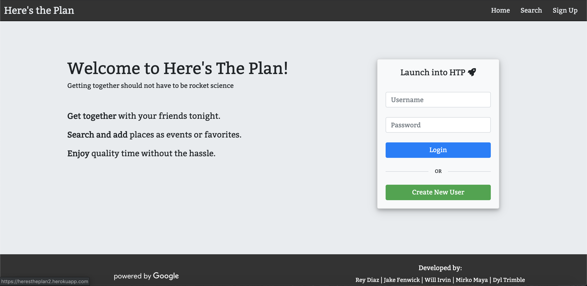

# Here's the Plan
"Because a night out shouldn't have to be rocket science."

## Description

*Here's the Plan* implements google maps api and geolocator to locate the user, a MySQL database to save user information and location information, and React.js to build the front end of the application. Once the user logs in they will be prompted to choose a locale type such as bakery, bar, restaurant, etc. once they choose an option the api will then go put and fetch locations within a 15km radius that match that locale type. They can then save those locations to an event or create a new one. 

Still in development is a friend feature to allow other user to attend your events and see exact times, address and location names for the events itinerary.

*Here's the Plan* application is meant to give users a way to show large groups of friends the evenings itinerary and make going out less a game of "where are we going?" and more a night of "That's awesome!". The application is implemented using a [Node.js](https://nodejs.org/en/) and [Express](https://expressjs.com/) server on the back end. The front end is built with [React.js](https://reactjs.org/) as the framework and [SCSS](https://sass-lang.com/) with [Bootstrap](https://getbootstrap.com/) for the style.

## Demo
	
*Here's the Plan* is deployed to Heroku. Please check it out [here](https://herestheplan2.herokuapp.com/).

Creators:

* [Jake Fenwick](https://github.com/JakeFen) [Dylan Trimble](https://github.com/dylantrimble) [Rey Diaz](https://github.com/ReyDiaz33) [Mirko Maya](https://github.com/mirkomaya) [Will Irvin](https://github.com/Will-25)